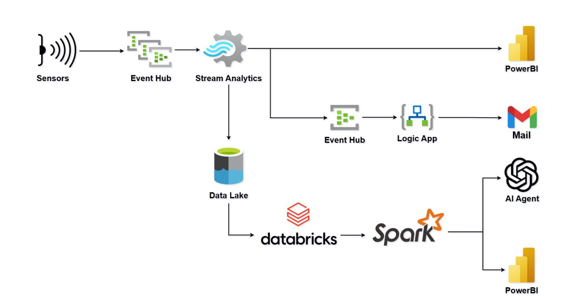
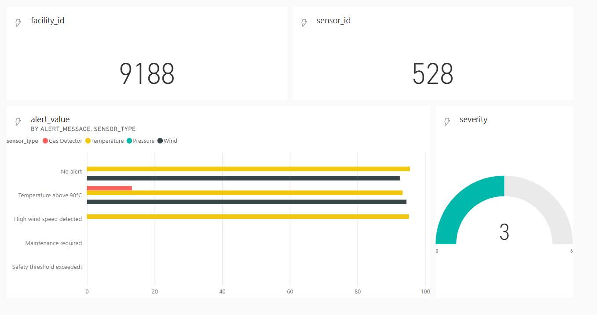
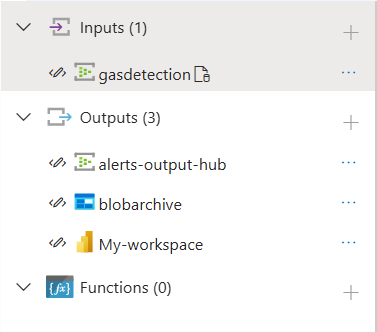
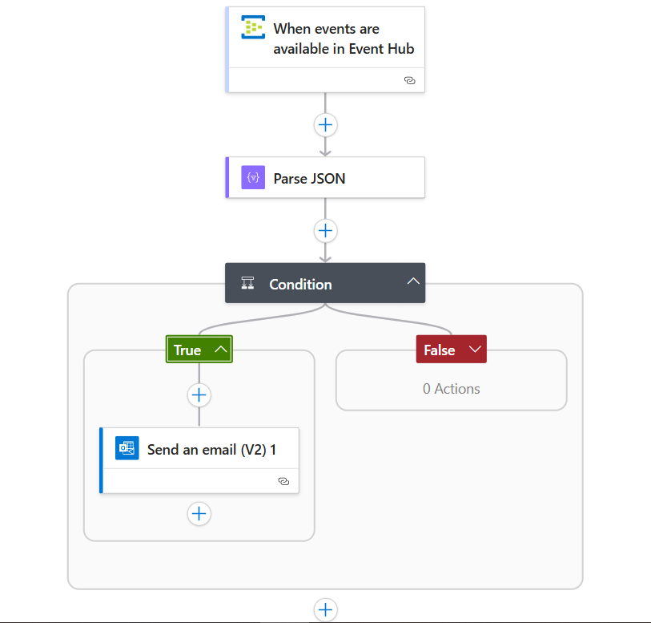
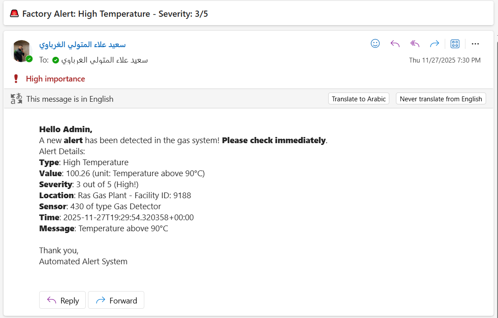
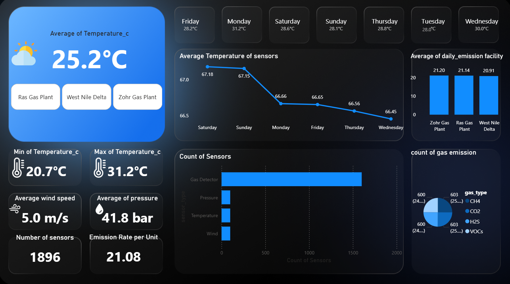
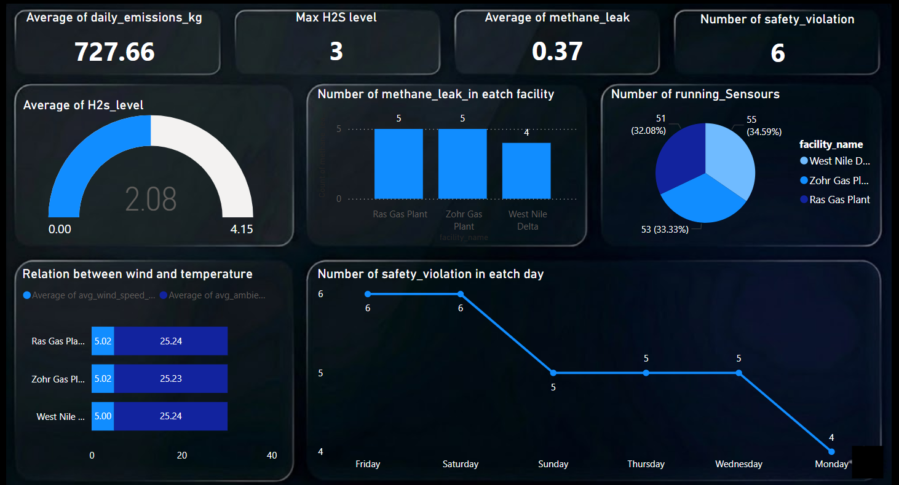

Factory 360 – Real-Time Intelligence Platform
=============================================

[Azure](https://img.shields.io/badge/Azure-0078D4?style=for-the-badge&logo=Azure&logoColor=white) [Databricks](https://img.shields.io/badge/Databricks-FF6D00?style=for-the-badge&logo=Databricks&logoColor=white) [Power BI](https://img.shields.io/badge/PowerBI-F68C1F?style=for-the-badge&logo=PowerBI&logoColor=white)

**Full Monitoring and Analytics for Factories and Industrial Equipment**

Factory 360 is a real-time intelligence platform designed for gas and energy facilities. It ingests sensor data every 5 seconds, detects anomalies, sends instant alerts, archives historical data, and enables natural language querying for insights. Built with Azure services and Databricks, it follows the Medallion Architecture for scalability and accuracy.

*   **Facilities Monitored**: Ras Gas Plant, West Nile Delta, Zohr Gas Plant
    
*   **Sensors**: Gas Detector (CH4, H2S, CO2, VOCs), Temperature, Pressure, Wind
    
*   **Key Features**: Real-time alerts (email/Live Dashboard), AI-powered queries via Genie
    
(Real-time pipeline: Sensors → Event Hub → Stream Analytics → Power BI/Logic App/Databricks)

Problem Statement
-----------------

In gas facilities, leaks or high temperatures can occur in seconds, leading to safety risks, environmental damage, and financial losses. Traditional monitoring is manual and delayed, missing critical windows for response.

Solution Overview
-----------------

Factory 360 transforms raw sensor data into actionable intelligence:

*   **Real-Time Detection**: Classifies alerts with severity (1-5 scale).
    
*   **Notifications**: Immediate email for critical events (severity ≥3).
    
*   **Historical Analytics**: Medallion layers (Bronze → Silver → Gold) for trends and ML.
    
*   **Intelligent Querying**: Genie AI answers questions like "H2S incidents last week?" in natural language.
    

Architecture & Components
-------------------------

### 1\. Real-Time Ingestion

*   **Sensors**: Generate readings every 5 seconds (status, metrics, environmental data).
    
*   **Azure Event Hub**: Streams data to "gas-detection" topic, partitioned by facility\_id for parallelism.
    
        

### 2\. Processing with Stream Analytics

*   Ingests from Event Hub, applies unified SQL query to classify alerts (Methane Leak = severity 5).
    
*   Outputs to 3 destinations:
    
    *   **Power BI**: Live dashboards for monitoring.

    
        
    *   **Event Hub (alerts-output-hub)**: Triggers notifications.
        
    *   **Blob Storage (blobarchive)**: Daily append for historical data.
        

### 3\. Notifications via Logic App

*   Triggered by Event Hub events; parses JSON, filters severity ≥3.
    
*   Sends high-priority email with details (type, value, location, dashboard link).
    

### 4\. Historical & Analytics Layer (Databricks Medallion Architecture)

*   **Bronze**: Raw incremental ingestion from Blob (merge on timestamp/sensor\_id).
    
*   **Silver**: Cleaning, enrichment (risk levels, outliers), deduplication.
    
*   **Gold**: Dimensional model (dims: Time/Facility/Sensor; fact: daily aggregates like emissions/leak counts).
    

Automated hourly pipeline ensures fresh data without code duplication.

### 5\. Intelligent Querying with Genie

*   Semantic joins (dim\_facility to fact on facility\_id = facility\_key).
    
*   Tailored for roles: Plant Managers (KPIs), HSE (safety metrics), Climate Scientists (emissions), Techs (repairs).
    
*   Example: 

### 6\. Power Bi Dashboards
*    Dashboard 1

*    Dashboard 2

### Prerequisites

*   Azure Subscription (Event Hub, Stream Analytics, Power BI, Logic App, Blob, Databricks).
    
*   Python 3.8+ for simulation generator.
    

### Quick Start

1.  pip install azure-eventhubpython data\_generator.py_(Sends mock data to Event Hub every 5s)_
    
2.  **Deploy Stream Analytics Query** (copy-paste the SQL above).
    
3.  **Configure Logic App** (Event Hub trigger + email action).
    
4.  **Run Databricks Pipeline** (hourly job for Medallion layers).
    
5.  **Test Genie** (ask: "H2S leaks in Ras Gas this month?").
    

    

Recommendations
---------------

*   **Architecture**: Use Medallion (Bronze-Silver-Gold) with Delta Lake for unified real-time/historical processing.
    
*   **For Oil & Gas**: Prioritize severity ≥3 alerts; retain data 7+ years for compliance.
    
*   **Scalability**: Add predictive ML (leak forecasting) on Gold layer.
    
*   **Cost**: Autoscale Databricks + Spot instances = 50% savings.
    

